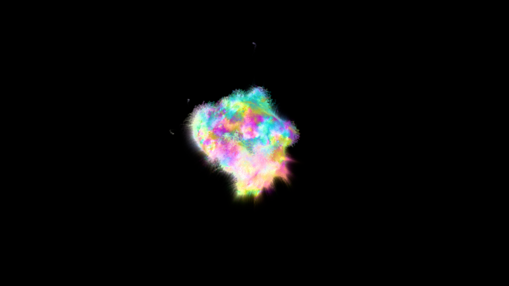

# Boids

3D boids simulation, handles 1M+ particles on 200^3 grid in real time. Colorized by displaying velocity of each particle/grid point.

## In action

## Controls

- F1 - show/hide UI
- F4 - pause/resume

# Build Instructions

**Requirements:**
* Visual Studio (preferably 2019 or 2017)
  
**Steps**
1. Clone [Builder repo](https://github.com/janivanecky/builder)
2. Make sure that path in `build.bat` inside Builder repo points to existing `vcvarsall.bat` (depends on your VS installation version)
3. Run `build.bat`
4. Optionally run `setup.bat` to setup PATH - you'll be able to run builder just by using `build` command
5. Clone [cpplib repo](https://github.com/janivanecky/cpplib)
6. Clone this repo
7. Run `build run ./boids.build` - if you didn't setup PATH in step 4, you'll have to use `YOUR_BUILDER_REPO_PATH/bin/build.exe` instead

If there are any problems you encounter while building the project, let me know.